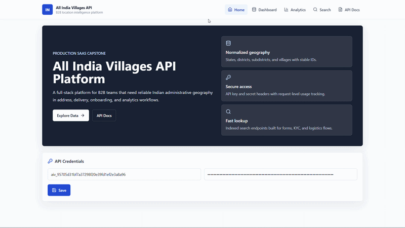
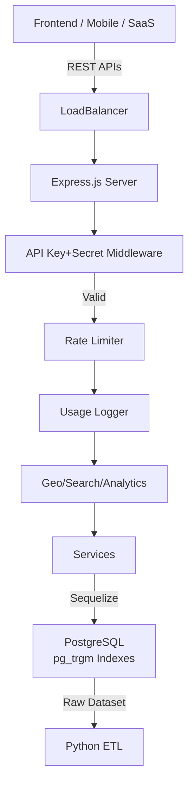

# 📍 All India Villages API Platform

<div align=\"center\">

[](https://nodejs.org)
[](https://react.dev)
[](https://expressjs.com)
[](https://postgresql.org)
[](https://docker.com)
[ yellow)](LICENSE)

**Production-grade B2B location intelligence platform delivering structured APIs for India's 4.5L+ villages, districts, and states. Powers KYC, logistics, address validation, and geospatial apps with secure, scalable endpoints.**

[](https://github.com/yourusername/all-india-villages-api/stargazers)
[](https://github.com/yourusername/all-india-villages-api/network)

</div>

## 🎥 Live Demo

<div align=\"center\">



*Full-stack dashboard with search, analytics, and API key management.*

- **Frontend Dashboard**: http://localhost:5173
- **API Playground**: http://localhost:5000/api/health
- **Postman Collection**: [Download](./docs/Postman.collection.json)

</div>

## ✨ Key Features

- 🔐 **Enterprise-Grade Authentication**: API Key + Secret (SHA-256 hashed) with usage tracking
- 🌍 **Hierarchical Geo APIs**: States → Districts → Subdistricts → 450,000+ Villages w/ pagination, search, filtering
- 🔍 **Full-Text Search**: pg_trgm-powered fuzzy matching across locations
- 📊 **Built-in Analytics**: API usage overview, top endpoints, response times
- ⚡ **Production Middleware**: Rate limiting, validation (Joi), structured logging, error handling
- 🏗️ **Scalable Architecture**: Normalized PostgreSQL, Sequelize ORM, Python data pipeline for massive CSVs
- 🚀 **Docker Ready**: One-command deployment (docker-compose up)
- 📱 **React Dashboard**: Real-time charts, credential management, interactive docs
- 🧪 **Tested & Documented**: Unit tests, comprehensive ERD, API specs

## 🏗️ System Architecture



## 🛠️ Tech Stack

| Category | Technologies |
|----------|--------------|
| **Frontend** | React 18, Vite, Tailwind CSS, React Query |
| **Backend** | Node.js 18, Express 4, Sequelize ORM |
| **Database** | PostgreSQL 14, pg_trgm extension |
| **Data Pipeline** | Python 3, Pandas, SQLAlchemy |
| **DevOps** | Docker Compose, GitHub Actions ready |
| **Tools** | Joi validation, Winston logging, Chart.js |

## 📁 Folder Structure

```
all-india-villages-api/
├── backend/           # Express MVC API server
│   ├── src/
│   │   ├── controllers/
│   │   ├── middleware/ (auth, rate-limit, etc.)
│   │   ├── models/    # Sequelize models
│   │   ├── routes/    # API routes
│   │   └── services/
├── frontend/          # React Vite dashboard
│   ├── src/
│   │   ├── components/
│   │   ├── pages/     # Dashboard, Analytics, Search
│   │   └── hooks/
├── database/          # Schema, migrations, seeds
├── dataset/           # Raw/cleaned data + Python ETL scripts
├── docs/              # API docs, ERD, setup guides
└── docker-compose.yml
```

## 🔌 API Endpoints

| Method | Endpoint | Description | Params | Auth |
|--------|----------|-------------|--------|------|
| `POST` | `/api/auth/generate-key` | Generate API credentials | `name`, `email` | No |
| `GET` | `/api/states` | List states | `page`, `limit`, `q` | Yes |
| `GET` | `/api/states/:id` | Get state | `id` | Yes |
| `GET` | `/api/districts` | List districts | `stateId`, `page`, `limit`, `q` | Yes |
| `GET` | `/api/districts/:id` | Get district | `id` | Yes |
| `GET` | `/api/subdistricts` | List subdistricts | `districtId`, `page`, `limit` | Yes |
| `GET` | `/api/villages` | List villages | `subdistrictId`, `q`, `page`, `limit` | Yes |
| `GET` | `/api/search` | Unified search | `village\|district\|state=q`, `page`, `limit` | Yes |
| `GET` | `/api/analytics/overview` | Usage analytics | None | Yes |
| `GET` | `/api/health` | Health check | None | No |

**Response Format**:
```json
{
  \"success\": true,
  \"data\": [...],
  \"meta\": { \"page\": 1, \"limit\": 25, \"total\": 123 }
}
```

## 🔐 Authentication Guide

1. **Generate Credentials**:
```bash
curl -X POST http://localhost:5000/api/auth/generate-key \\
  -H \"Content-Type: application/json\" \\
  -d '{\"name\":\"Acme Corp\",\"email\":\"dev@acme.com\"}'
```
Response: `{ \"apiKey\": \"key_abc123\", \"apiSecret\": \"secret_xyz\" }` (secret one-time).

2. **Use in Requests**:
```http
x-api-key: key_abc123
x-api-secret: secret_xyz
```

Demo creds: `demo_key_123456` / `demo_secret_123456`

## 🚀 Quick Start (Docker)

```bash
git clone https://github.com/yourusername/all-india-villages-api.git
cd all-india-villages-api
docker compose up --build -d
```

- Frontend: http://localhost:5173
- Backend: http://localhost:5000/api/health

## 🛠️ Local Development

### Backend
```bash
cd backend
cp .env.example .env
npm install
npx sequelize-cli db:migrate
npx sequelize-cli db:seed:demo
npm run dev  # http://localhost:5000
```

### Frontend
```bash
cd frontend
cp .env.example .env
npm install
npm run dev  # http://localhost:5173
```

### Dataset Import (First Time)
```bash
cd dataset/scripts
python -m venv venv
venv/bin/activate  # or .venv\Scripts\activate on Windows
pip install -r requirements.txt
python setup_and_import.py
```

## ⚙️ Environment Variables

| Key | Description | Default |
|----|-------------|---------|
| `PORT` | Server port | 5000 |
| `DB_HOST` | PostgreSQL host | localhost |
| `DB_PORT` | DB port | 5432 |
| `DB_NAME` | Database name | villages_api |
| `DB_USER` | DB username | postgres |
| `DB_PASS` | DB password | password |
| `JWT_SECRET` | Internal secret | change_me |
| `RATE_LIMIT_WINDOW` | Rate limit ms | 900000 |
| `RATE_LIMIT_MAX` | Requests per window | 100 |

Copy `.env.example` to `.env`.

## 🗄️ Database Setup

1. PostgreSQL running (docker or local).
2. Run migrations: `npm run db:migrate`.
3. Seed demo: `npm run db:seed`.
4. Import full dataset via Python scripts.

Schema auto-creates indexes + pg_trgm for search.

## 📊 Analytics Dashboard

The `/analytics/overview` endpoint + React charts show:
- Total geo records (states/districts/villages)
- API calls count, avg response time
- Top 10 endpoints, daily usage trends

Logs every request to `api_logs` table.


## ⚡ Challenges Overcome

- **Scale**: Processed/normalized 450k+ villages from messy Excel (Pandas dedup/slug gen).
- **Search Perf**: pg_trgm GIN indexes for fuzzy village name matching.
- **Hierarchy**: Strict FK cascades + slug uniqueness per parent.
- **Security**: Secret hashing, IP logging, rate limits.

## 🚀 Future Roadmap

- Redis caching for hot queries
- GeoJSON exports
- Tiered plans (rate limits)
- Bulk CSV upload API
- Real-time WebSocket updates

## 🤝 Contributing

1. Fork → Clone → Create `feat/xyz` branch
2. `npm install` / `npm test`
3. Commit: `git commit -m \"feat: add xyz\"`
4. PR to `main` with tests/docs

See [CONTRIBUTING.md](CONTRIBUTING.md) for details.

## 📄 License

This project is [MIT](LICENSE) licensed.

## 👨‍💻 Author

**Animesh Sahoo** - Full-Stack Engineer  
[LinkedIn](https://linkedin.com/in/animesh-sahoo-b03151302) | [Portfolio](https://animesh6532.netlify.app/) | animeshsahoo451@gmail.com

Built as capstone project showcasing production SaaS patterns.

<div align=\"center\">

⭐ **Star this repo if you found it useful!** ⭐

</div>

